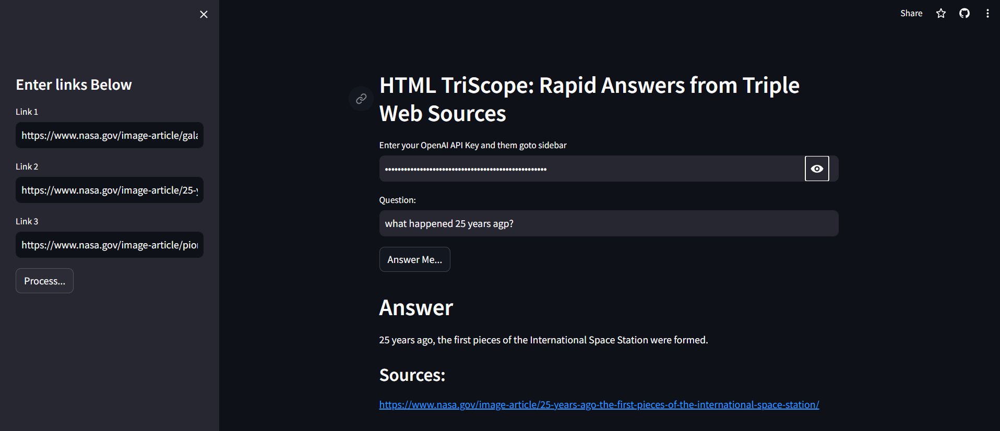

# 🌐 HTML TriScope: Rapid Answers from Triple Web Sources 🌟

## Overview 📖
HTML TriScope is a Proof of Concept (POC) project based on LangChain and OpenAI's language models (LLMs). This innovative tool demonstrates the construction of an information retrieval system capable of extracting and synthesizing information from three provided HTML URLs. It's an excellent project for beginners, illustrating the use of a RAG (Retrieval-Augmented Generation) pipeline, which includes document retrieval, filtering, and prompt injection – key components of a typical RAG framework. 🚀🔍

## Live Application
Check out the live version of HTML TriScope here: [HTML TriScope App](https://html-triscope.streamlit.app/)

## Features ✨
- **Triple URL Analysis**: Delve into three different web sources to find comprehensive answers.
- **Powered by OpenAI and LangChain**: Harnesses the latest AI technology for precise and relevant information retrieval.
- **User-Friendly Interface**: Simple and intuitive, perfect for facilitating easy information discovery.
- **Demonstrates RAG Pipeline**: A great example for those looking to understand the RAG framework in practice.

## Installation and Usage 🛠️

### Prerequisites
- Python 3.x
- pipenv (Python package manager)

